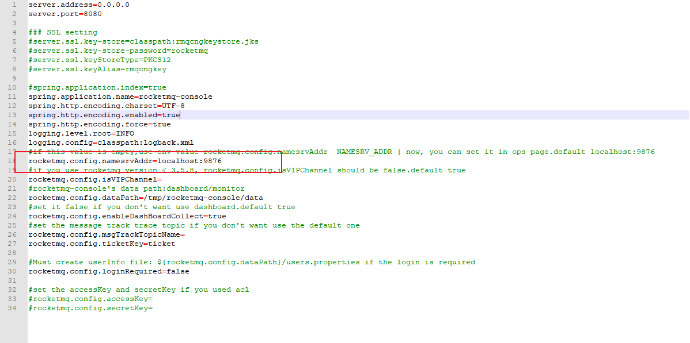

### RocketMQ
- 下载：
  https://www.apache.org/dyn/closer.cgi?path=rocketmq/4.9.0/rocketmq-all-4.9.0-bin-release.zip

- 环境变量
ROCKETMQ_HOME
D:\rocketmq-all-4.9.0-bin-release
path
%ROCKETMQ_HOME%\bin
  
- 启动
  启动名称服务 mqnamesrv.cmd
  启动数据中心 mqbroker.cmd -n localhost:9876

- demo
https://github.com/apache/rocketmq-spring
- 可视化界面
  https://github.com/apache/rocketmq-externals
  打开rocketmq-console子项目的application.properties文件，并配置好注册中心地址。
  

打包成jar包

```java
mvn clean package -Dmaven.test.skip=true
```

运行

```
java -jar rocketmq-console-ng-2.0.0.jar
```

访问localhost:8080